# DevOps Observability Lab — Final Project

[](https://github.com/anaBalukha/devops-observability-lab/actions/workflows/ci.yml)
[](https://github.com/anaBalukha/devops-observability-lab/actions/workflows/security.yml)

A complete local DevOps project that combines application delivery, observability, security automation, reliability engineering, blue-green deployment, and rollback verification.

Repository: **https://github.com/anaBalukha/devops-observability-lab**

The complete project can be evaluated locally using free and publicly available tools.

---

## Table of Contents

1. [Project Overview](#project-overview)
2. [Architecture](#architecture)
3. [Technology Stack](#technology-stack)
4. [Project Structure](#project-structure)
5. [Quick Start](#quick-start)
6. [Service URLs](#service-urls)
7. [Application Endpoints](#application-endpoints)
8. [Monitoring and Metrics](#monitoring-and-metrics)
9. [Logging](#logging)
10. [Alerting](#alerting)
11. [Health Monitoring and Recovery](#health-monitoring-and-recovery)
12. [Blue-Green Deployment](#blue-green-deployment)
13. [Rollback](#rollback)
14. [CI/CD](#cicd)
15. [Security Automation](#security-automation)
16. [Testing and Code Quality](#testing-and-code-quality)
17. [Branching Strategy](#branching-strategy)
18. [Reliability Documentation](#reliability-documentation)
19. [Required Analysis](#required-analysis)
20. [Troubleshooting](#troubleshooting)
21. [Requirement Mapping](#requirement-mapping)
22. [Evidence Gallery](#evidence-gallery)

---

## Project Overview

This project began as a Docker Compose observability lab and was extended into a secure, automated, reliable, and production-oriented DevOps solution.

The application is a Python Flask service served by Gunicorn. Two application environments, **blue** and **green**, run behind an Nginx gateway. Only one environment receives public traffic at a time, while the other remains available for deployment verification and fast rollback.

The project includes:

- Git version control and a `main` / `dev` branching strategy
- Automated CI on pushes and pull requests
- Automated Docker validation and application health verification
- Automated blue-green deployment and rollback testing
- One-command local environment preparation
- Prometheus metrics
- Grafana dashboards and alerting
- Loki and Promtail centralized logging
- Structured JSON application logs
- Continuous health monitoring
- Docker health checks and automatic restart policies
- Dependency, source-code, secret, configuration, and image security scans
- Service-level objectives, rollback documentation, and incident response procedures

---

## Architecture

### Runtime Architecture

```text
                         +----------------------+
                         |   User / Evaluator   |
                         +----------+-----------+
                                    |
                                    | http://localhost:5000
                                    v
                         +----------------------+
                         |    Nginx Gateway     |
                         |  active.conf routing |
                         +----+------------+----+
                              |            |
                    active -->|            |<-- standby
                              v            v
                    +---------------+  +---------------+
                    |   App Blue    |  |   App Green   |
                    | Flask/Gunicorn|  | Flask/Gunicorn|
                    +-------+-------+  +-------+-------+
                            |                  |
                            +--------+---------+
                                     |
                       structured JSON application logs
                                     |
                                     v
                    +-------------------------------+
                    | Shared application log volume |
                    +---------------+---------------+
                                    |
                                    v
                              +-----------+
                              | Promtail  |
                              +-----+-----+
                                    |
                                    v
                               +---------+
                               |  Loki   |
                               +----+----+
                                    |
                                    v
                               +---------+
                               | Grafana |
                               +---------+

Nginx Gateway /metrics ----> Prometheus ----> Grafana

Health Monitor checks:
- Nginx gateway
- Prometheus
- Loki
- Grafana
```

### CI/CD Workflow

```text
Push or Pull Request
        |
        v
Python Quality and Security
- Ruff
- Pytest
- Coverage >= 80%
- pip-audit
- Bandit
        |
        v
Docker Validation and Build
- Compose validation
- Image build
- Endpoint verification
- Docker health verification
        |
        v
Blue-Green Deployment Verification
- Start complete environment
- Verify initial blue traffic
- Deploy version 1.1.0 to green
- Verify green traffic and version
- Roll back to blue
- Run smoke tests

Parallel security workflow:
- Gitleaks secret scanning
- Trivy repository/configuration scanning
- Trivy container-image scanning
```

---

## Technology Stack

| Area | Technology |
|---|---|
| Application | Python 3.13, Flask |
| Production server | Gunicorn |
| Reverse proxy | Nginx |
| Containers | Docker |
| Orchestration | Docker Compose |
| Metrics | Prometheus |
| Dashboards | Grafana |
| Logs | Loki |
| Log collection | Promtail |
| Testing | Pytest |
| Coverage | pytest-cov |
| Linting | Ruff |
| Dependency security | pip-audit |
| Static-security analysis | Bandit |
| Secret scanning | Gitleaks |
| Repository/config scanning | Trivy |
| Container-image scanning | Trivy |
| Automation | Bash, PowerShell, Python |
| CI/CD | GitHub Actions |
| Version control | Git and GitHub |

---

## Project Structure

```text
devops-observability-lab/
├── .deployment/
│   └── .gitkeep
├── .github/
│   └── workflows/
│       ├── ci.yml
│       └── security.yml
├── app/
│   ├── .dockerignore
│   ├── __init__.py
│   ├── app.py
│   ├── Dockerfile
│   └── requirements.txt
├── docs/
│   ├── INCIDENT_RESPONSE.md
│   ├── ROLLBACK.md
│   └── SLO.md
├── grafana/
│   ├── dashboards/
│   └── provisioning/
├── logs/
│   ├── app/
│   └── health/
├── loki/
│   └── loki-config.yml
├── nginx/
│   └── default.conf
├── prometheus/
│   ├── alert.rules.yml
│   └── prometheus.yml
├── promtail/
│   └── promtail-config.yml
├── screenshots/
├── scripts/
│   ├── deploy.sh
│   ├── health_monitor.py
│   ├── rollback.sh
│   ├── setup.ps1
│   ├── setup.sh
│   └── smoke_test.py
├── tests/
│   └── test_app.py
├── .env.example
├── .gitattributes
├── .gitignore
├── docker-compose.yml
├── README.md
└── requirements-dev.txt
```

Runtime-generated files are ignored by Git:

```text
.env
nginx/active.conf
.deployment/active_color
.deployment/previous_color
logs/health/health.log
```

---

## Quick Start

### Requirements

Install:

- Git
- Docker Desktop or Docker Engine
- Docker Compose
- Python 3.13 or another compatible modern Python version

Verify:

```bash
git --version
docker --version
docker compose version
python --version
```

Docker Desktop must be running before setup.

### One-Command Setup — Git Bash, Linux, or macOS

```bash
bash scripts/setup.sh
```

### One-Command Setup — Windows PowerShell

```powershell
powershell -ExecutionPolicy Bypass -File scripts/setup.ps1
```

The setup automation:

1. Checks Docker and Docker Compose
2. Checks that the Docker engine is running
3. Detects Python
4. Generates a local `.env` file when needed
5. Generates the initial Nginx runtime configuration
6. Validates Docker Compose
7. Builds and starts all services
8. Runs deployment smoke tests
9. Prints service URLs

The generated `.env` file is ignored by Git.

### Environment Automation Evidence

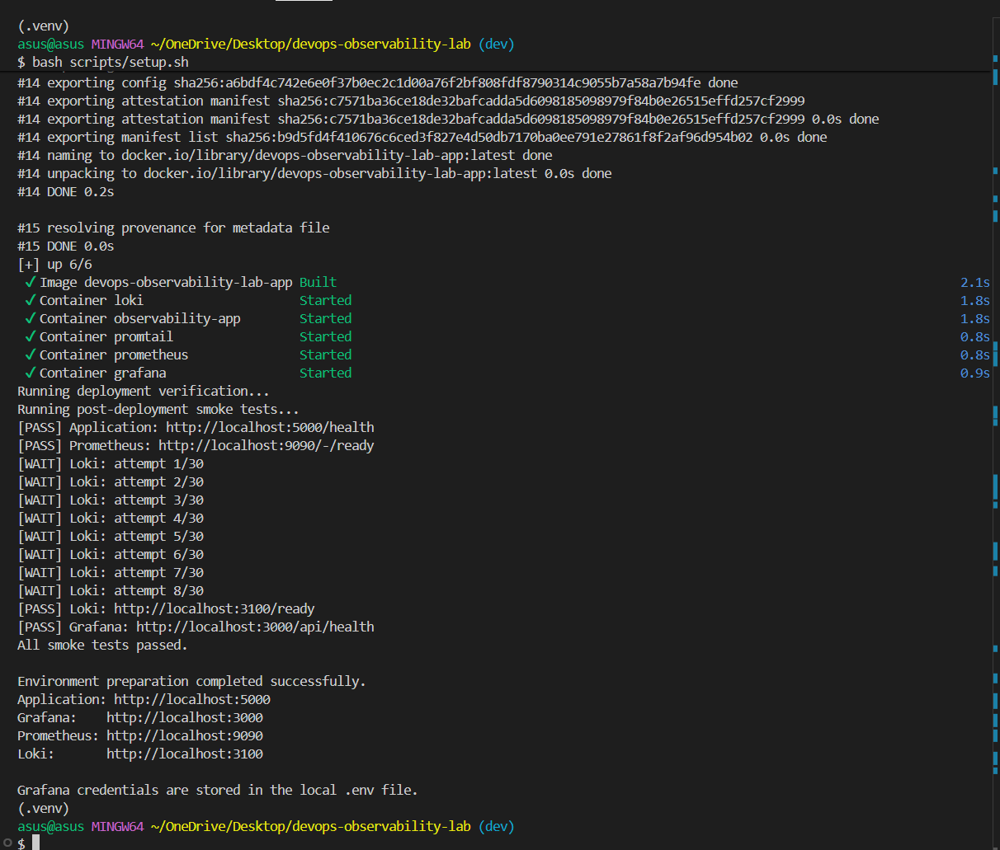

### Running Services Evidence

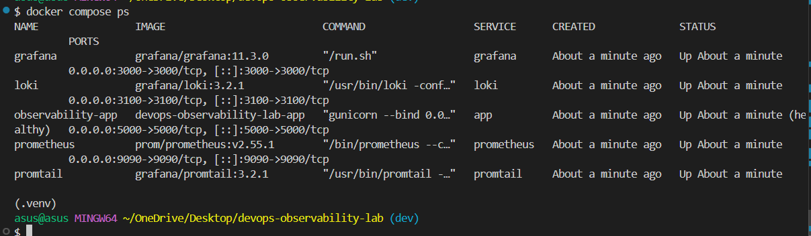

---

## Service URLs

| Service | URL |
|---|---|
| Public application gateway | `http://localhost:5000` |
| Application health | `http://localhost:5000/health` |
| Application metrics | `http://localhost:5000/metrics` |
| Grafana | `http://localhost:3000` |
| Prometheus | `http://localhost:9090` |
| Loki readiness | `http://localhost:3100/ready` |

Grafana username:

```text
admin
```

The generated password is stored in the local `.env` file.

---

## Application Endpoints

| Endpoint | Purpose |
|---|---|
| `/` | Application information |
| `/health` | Health, version, and active color |
| `/metrics` | Prometheus metrics |
| `/greet?name=Anna` | Dynamic input endpoint |
| `/error` | Simulated HTTP 500 error |
| `/generate-errors?count=6` | Generates custom error metrics |

Examples:

```bash
curl -s http://localhost:5000/
```

```bash
curl -s http://localhost:5000/health
```

```bash
curl -s "http://localhost:5000/greet?name=Anna"
```

Example health response:

```json
{
  "color": "blue",
  "status": "UP",
  "version": "1.0.0"
}
```

Input validation examples:

```bash
curl -i http://localhost:5000/greet
```

```bash
curl -i "http://localhost:5000/generate-errors?count=bad"
```

Expected result:

```text
HTTP/1.1 400 BAD REQUEST
```

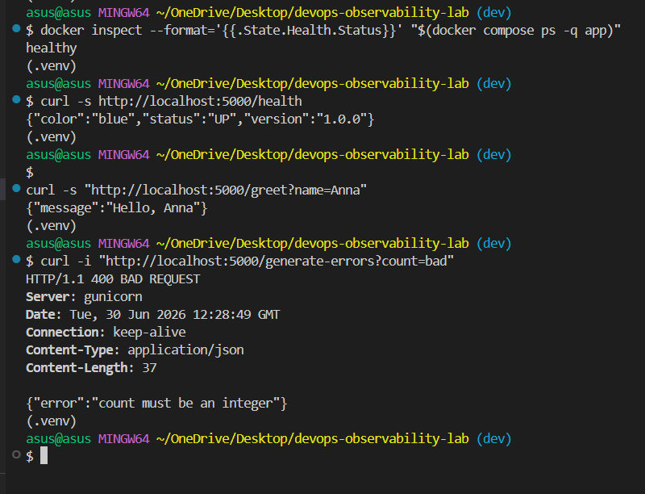

---

## Monitoring and Metrics

Prometheus collects metrics through the active Nginx gateway.

Custom metrics:

```text
app_requests_total
app_errors_total
app_request_duration_seconds
```

`app_requests_total` includes labels for endpoint, method, and status.

`app_errors_total` is used by the critical error alert.

`app_request_duration_seconds` supports latency analysis and percentile calculations.

Prometheus configuration:

```text
prometheus/prometheus.yml
```

Alert rules:

```text
prometheus/alert.rules.yml
```

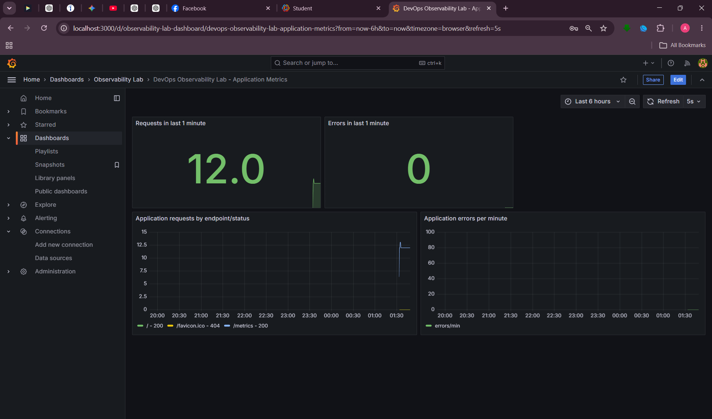

---

## Logging

The application writes structured JSON logs.

Example:

```json
{
  "timestamp": "2026-06-30T12:28:49.592722+00:00",
  "level": "INFO",
  "message": "request_completed",
  "logger": "observability_app",
  "request_id": "df96ab78-aebd-425d-bed7-db0a8499d4c3",
  "method": "GET",
  "path": "/generate-errors",
  "status": 400,
  "duration_ms": 0.12,
  "client_ip": "172.20.0.1",
  "event": "http_request"
}
```

JSON fields include timestamp, level, message, logger, request ID, method, path, status, duration, client IP, and event type.

Promtail reads application logs and sends them to Loki. Grafana queries Loki for analysis.

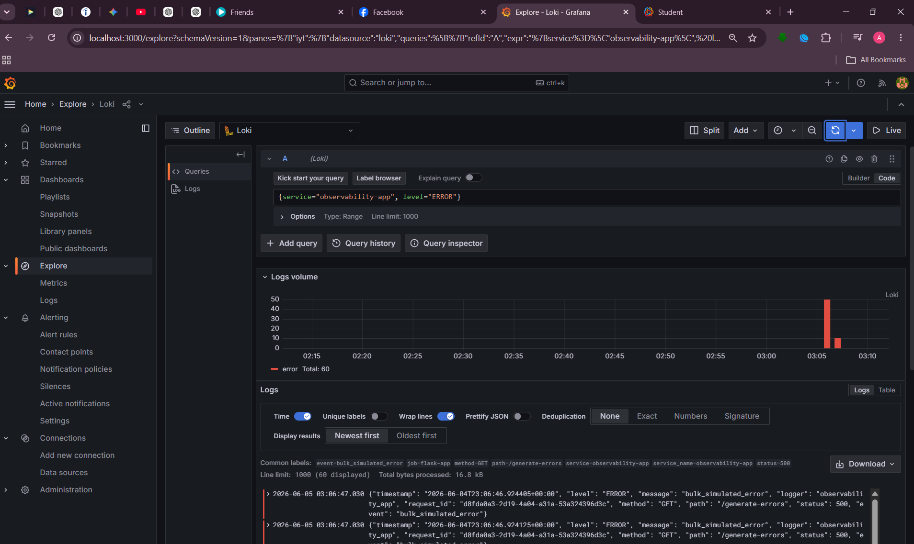

---

## Alerting

The project includes a critical Prometheus alert based on:

```promql
increase(app_errors_total[1m]) > 5
```

Trigger it with:

```bash
curl -s "http://localhost:5000/generate-errors?count=6"
```

Inspect alerts in Grafana or Prometheus:

```text
Grafana -> Alerting
http://localhost:9090/alerts
```

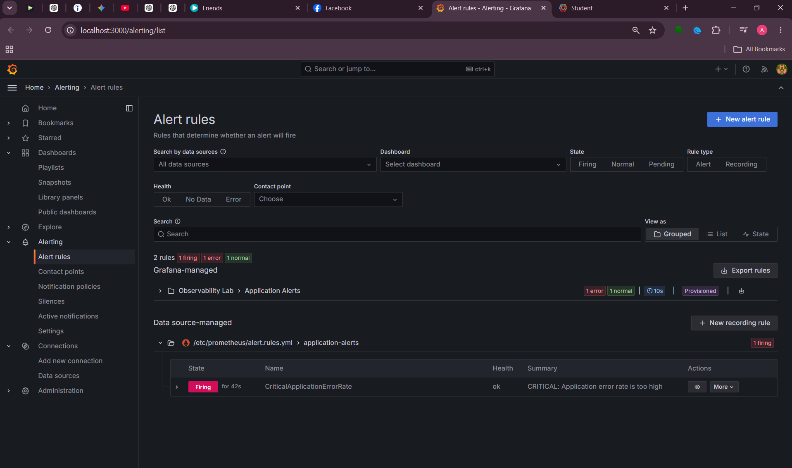

---

## Health Monitoring and Recovery

The custom health-monitor service checks:

- Public application gateway
- Prometheus
- Loki
- Grafana

It records UTC timestamp, service name, URL, UP/DOWN status, HTTP status, response time, and error details.

View container logs:

```bash
docker compose logs --tail=30 health-monitor
```

View persistent records:

```bash
tail -n 20 logs/health/health.log
```

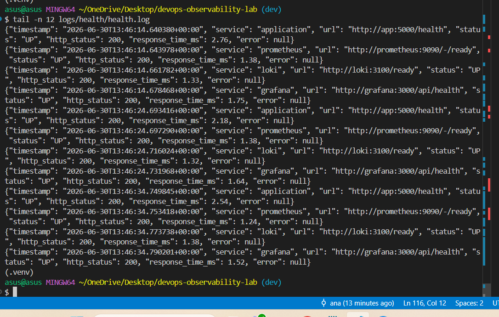

Docker services use:

```yaml
restart: unless-stopped
```

The project demonstrates automatic recovery by terminating the application process and verifying that restart count increases, the container returns to `running`, Docker health returns to `healthy`, and `/health` works again.

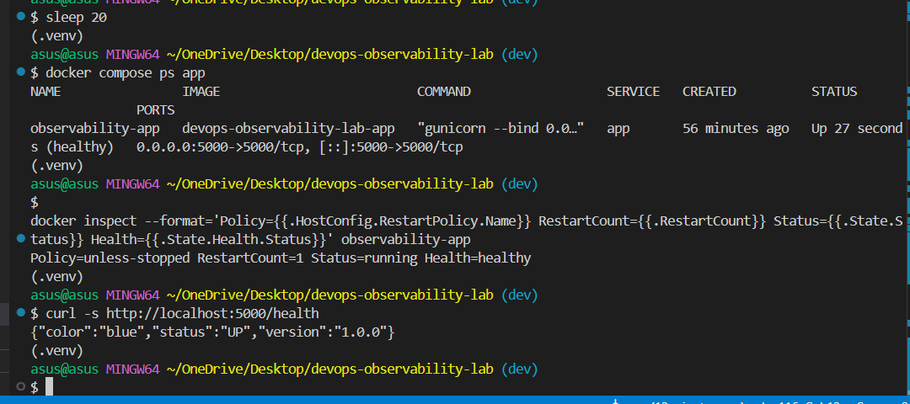

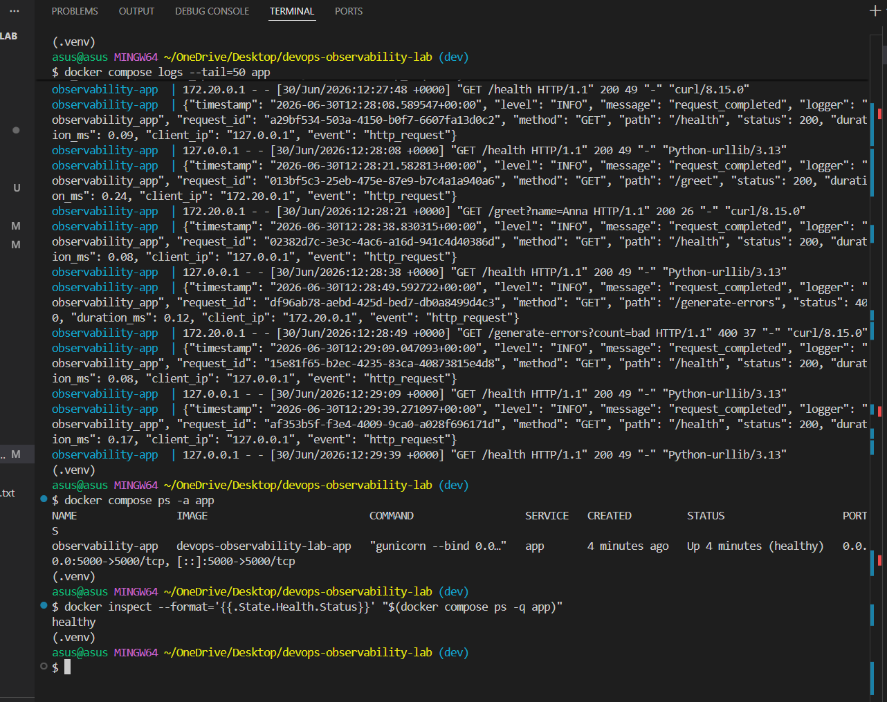

---

## Blue-Green Deployment

The project runs:

```text
app-blue
app-green
```

The Nginx gateway sends public traffic to one active backend.

Deployment state:

```text
.deployment/active_color
.deployment/previous_color
```

Runtime gateway configuration:

```text
nginx/active.conf
```

### Initial Environment

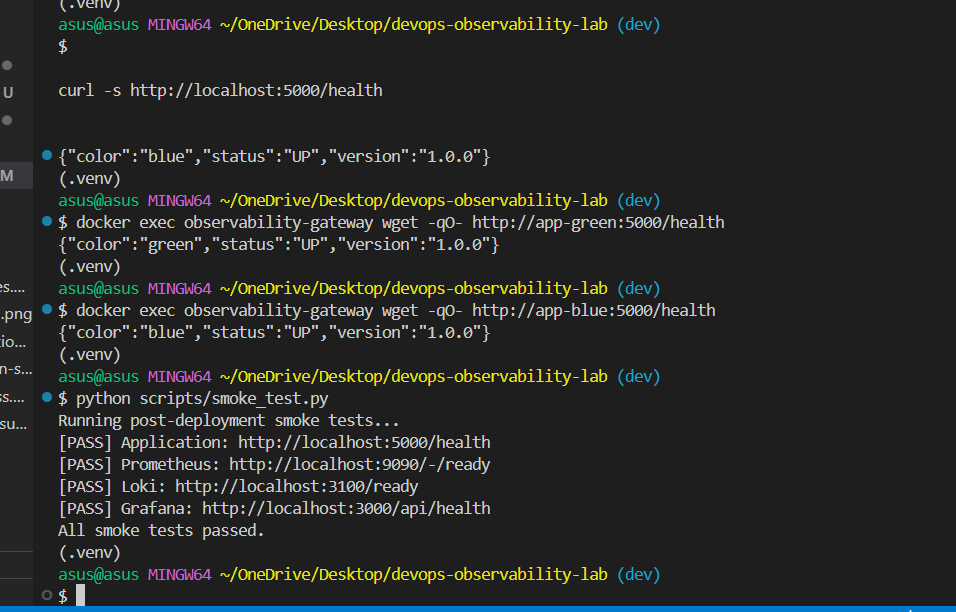

### Deploy a New Version

```bash
bash scripts/deploy.sh 1.1.0
```

The script selects the inactive color, builds it, waits for health, verifies color and version, validates Nginx, switches traffic, verifies the public response, and updates deployment state.

Expected output:

```text
Deployment completed successfully.
Active color: green
Previous color: blue
Version: 1.1.0
```

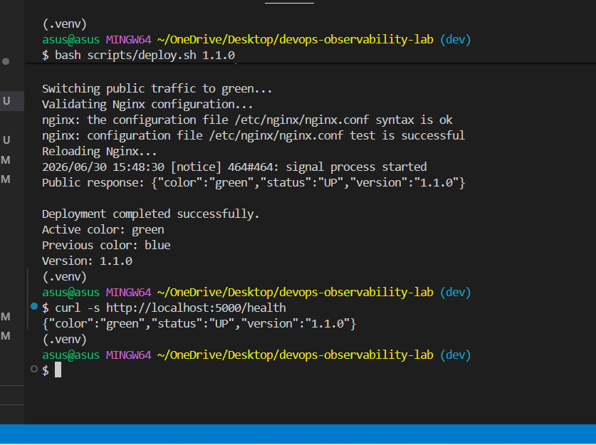

If verification fails, traffic is automatically restored to the original color.

---

## Rollback

Run:

```bash
bash scripts/rollback.sh
```

The rollback script verifies the previous backend, validates and reloads Nginx, verifies the public endpoint, and updates deployment state.

Expected output:

```text
Rollback completed successfully.
Active color: blue
Previous color: green
```

Run smoke tests:

```bash
python scripts/smoke_test.py
```

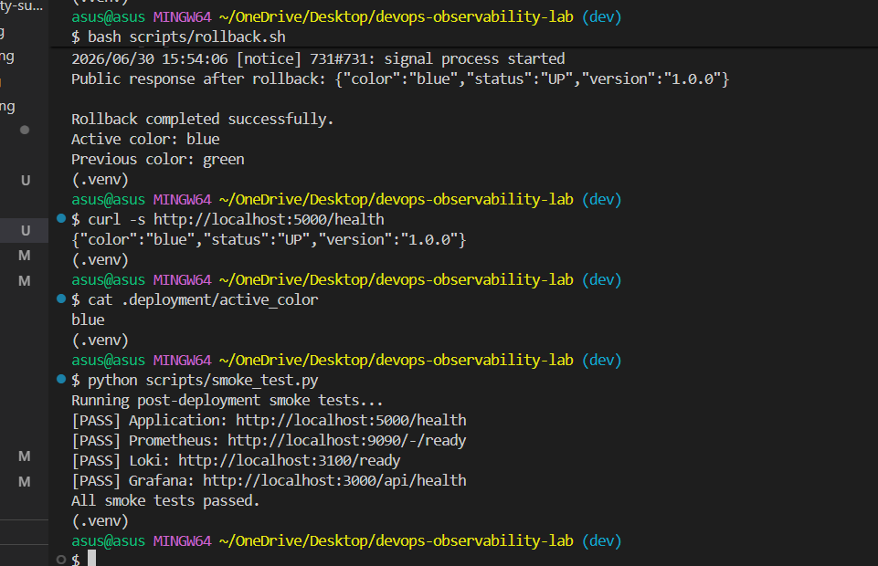

Detailed guide: [Blue-Green Rollback Guide](docs/ROLLBACK.md)

---

## CI/CD

### CI Quality and Security Workflow

File:

```text
.github/workflows/ci.yml
```

Triggers:

- pushes to `main`
- pushes to `dev`
- pull requests to `main`
- pull requests to `dev`
- manual dispatch

Jobs:

- Python Quality and Security
- Docker Validation and Build
- Blue-Green Deployment Verification

The deployment job starts the full environment, verifies blue, deploys green, verifies version `1.1.0`, rolls back to blue, runs smoke tests, and cleans up.

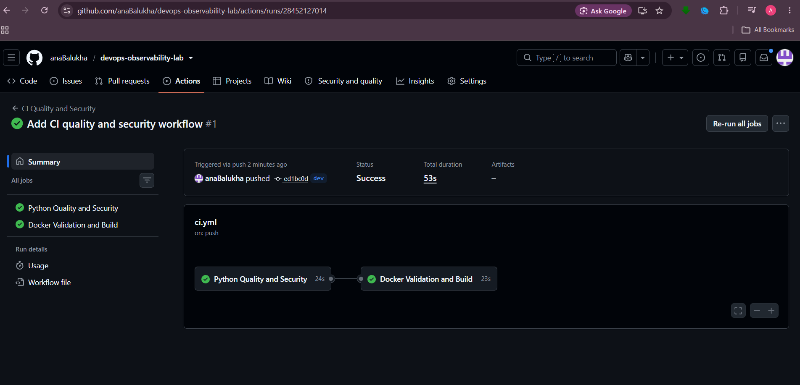

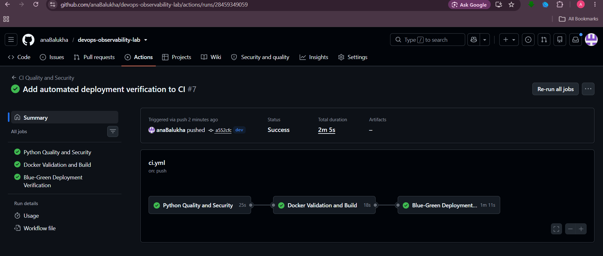

---

## Security Automation

Advanced security workflow:

```text
.github/workflows/security.yml
```

It includes:

- Gitleaks secret scanning
- Trivy repository and configuration scanning
- Trivy container-image scanning

Dependency scan:

```bash
pip-audit -r app/requirements.txt
```

Expected:

```text
No known vulnerabilities found
```

Static-security scan:

```bash
bandit -r app -ll
```

Expected:

```text
No issues identified.
```

Secrets are not hard-coded. Setup scripts generate `.env`, which is ignored by Git. GitHub Actions uses temporary CI-only values.

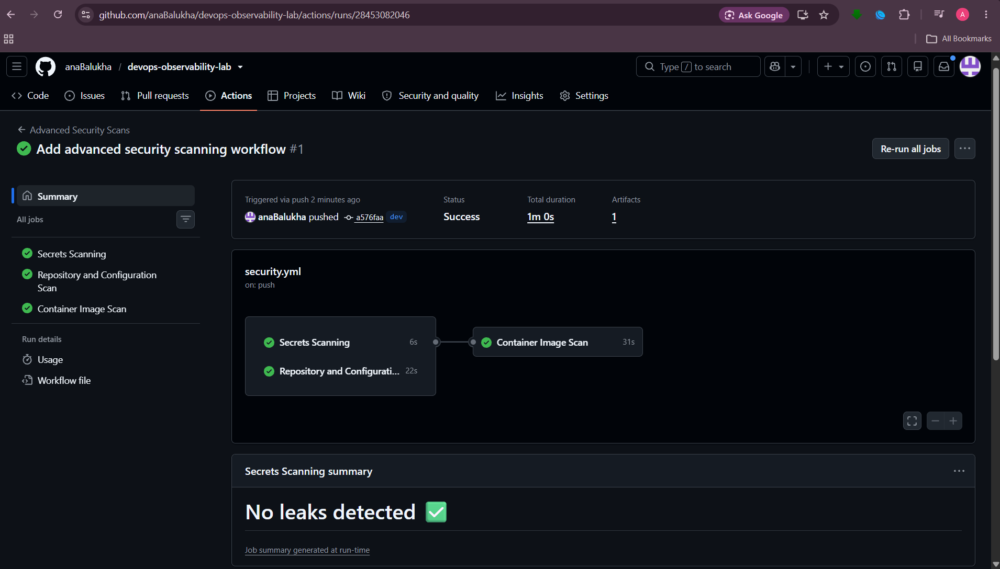

---

## Testing and Code Quality

Tests are located in:

```text
tests/test_app.py
```

Run linting:

```bash
python -m ruff check app tests scripts
```

Run tests:

```bash
python -m pytest -q --cov=app --cov-report=term-missing --cov-fail-under=80
```

Project result:

```text
13 passed
Approximately 99% coverage
```

Validate scripts:

```bash
bash -n scripts/deploy.sh scripts/rollback.sh scripts/setup.sh
```

Validate Docker Compose:

```bash
docker compose config --quiet
```

---

## Branching Strategy

Main branches:

```text
main
dev
```

Workflow:

```text
Feature work
    |
    v
dev branch
    |
    v
Automated CI and security workflows
    |
    v
Pull request
    |
    v
main branch
```

Development is performed on `dev`. CI and security checks run automatically. Final stable work is merged to `main` through a pull request.

---

## Reliability Documentation

- [Service-Level Objectives](docs/SLO.md)
- [Incident Response Guide](docs/INCIDENT_RESPONSE.md)
- [Blue-Green Rollback Guide](docs/ROLLBACK.md)

Targets:

| Objective | Target |
|---|---|
| Availability | 99% over a rolling 30-day period |
| Response time | 95% below 500 ms |
| HTTP 5xx error ratio | Below 1% |
| Recovery time | Within 10 minutes |

---

## Required Analysis

### Why Is JSON-Structured Logging More Efficient Than Plain Text?

JSON logs use named fields, so systems can parse, index, filter, group, and alert on exact values without fragile regular expressions. They also make request tracing and machine processing more reliable.

### What Is the Difference Between Prometheus and Loki?

Prometheus stores numerical time-series metrics, while Loki stores timestamped log records. Metrics support aggregation and alerting; logs provide detailed event context.

### How Should Six Months of Logs Be Retained?

A production design should use short local retention, compression, retention limits, automatic expiration, object storage, lifecycle policies, storage monitoring, and careful label usage. Loki can use self-hosted MinIO or another S3-compatible backend for long-term storage.

This local project uses:

```text
loki-data
```

That named volume is suitable for evaluation, but not unlimited production retention.

---

## Troubleshooting

### Docker Is Not Running

```bash
docker info
```

Start Docker Desktop and retry.

### Missing `.env`

```bash
bash scripts/setup.sh
```

### Missing `nginx/active.conf`

```bash
cp nginx/default.conf nginx/active.conf
```

or run setup again.

### Application Unhealthy

```bash
docker compose logs --tail=100 app-blue
docker compose logs --tail=100 app-green
```

### Gateway Unhealthy

```bash
docker exec observability-gateway nginx -t
docker compose logs --tail=100 gateway
```

### Smoke Test Failure

```bash
docker compose ps
docker compose logs --tail=100
```

Recreate:

```bash
docker compose down --remove-orphans
bash scripts/setup.sh
```

---

## Requirement Mapping

| Requirement | Implementation |
|---|---|
| Git version control | `main` and `dev` branches |
| Dynamic application | `/greet?name=Anna` |
| Input validation | Missing, long, and invalid input checks |
| Unit testing | 13 Pytest tests |
| Coverage | Approximately 99%, minimum 80% enforced |
| CI | Ruff, Pytest, coverage, pip-audit, Bandit |
| CD verification | Automated blue-green deployment and rollback |
| One-command automation | `setup.sh` and `setup.ps1` |
| Docker | Hardened Flask/Gunicorn image |
| Docker Compose | Complete local multi-service environment |
| Monitoring | Prometheus and Grafana |
| Logging | JSON logs, Promtail, Loki |
| Alerting | Critical error-rate alert |
| Health checks | App, gateway, Docker, custom monitor |
| Automatic recovery | Docker restart policy |
| Blue-green deployment | Blue and green behind Nginx |
| Rollback | Automated verified rollback |
| Dependency scanning | pip-audit |
| Static-security scanning | Bandit |
| Secret scanning | Gitleaks |
| Configuration scanning | Trivy |
| Container scanning | Trivy |
| Secrets management | Generated ignored `.env` |
| Incident response | `docs/INCIDENT_RESPONSE.md` |
| SLOs | `docs/SLO.md` |
| Rollback guide | `docs/ROLLBACK.md` |
| Free local execution | Docker and open-source tools |

---

## Evidence Gallery

### Environment and Docker


### Observability


### Reliability


### CI and Security


### Blue-Green Deployment


---

## Final Result

```text
Commit
  -> Automated quality checks
  -> Automated security checks
  -> Docker build validation
  -> Full environment startup
  -> Blue-green deployment
  -> Deployment verification
  -> Rollback verification
  -> Metrics and logs
  -> Alerting
  -> Continuous health monitoring
  -> Reliability documentation
```

All required functionality is executable locally using Docker Compose and free open-source tools.
